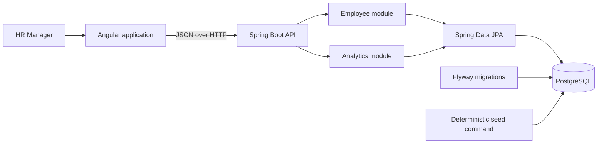

# Architecture

Payroll Lens is a small modular monolith. Angular owns the HR workflow and display state; Spring Boot owns input validation, employee and reporting rules, and JSON contracts. PostgreSQL stores the current employee snapshot. Flyway owns schema changes, while the deterministic seed process populates demo data only when explicitly requested.

The employee API's controller accepts requests and maps domain results to the public JSON contract. The employee model enforces current-salary and archive behavior, while repository predicates apply search and filters in the database before paging. Reporting uses the same active-record and filter semantics, so a directory selection and its pay summary describe the same population.

An employee stores identity, country, department, job title/level, annual salary amount, ISO currency code, and archive status. Amounts use decimal arithmetic. Reports retain local-currency values on employee records and convert only for explicitly labelled USD aggregates with a fixed rate date. No salary history table is planned for this release.

Integration boundaries are intentionally narrow: HTTP JSON, JPA, and PostgreSQL. Unit tests cover salary, seed, and report calculations; focused Spring tests cover HTTP, persistence, and migrations. Angular tests will exercise user interactions. The [API contract](api-contract.md) is the client/server reference; the [README status table](../README.md#delivered-behavior-and-next-milestones) distinguishes delivered behavior from remaining UI and deployment work.
